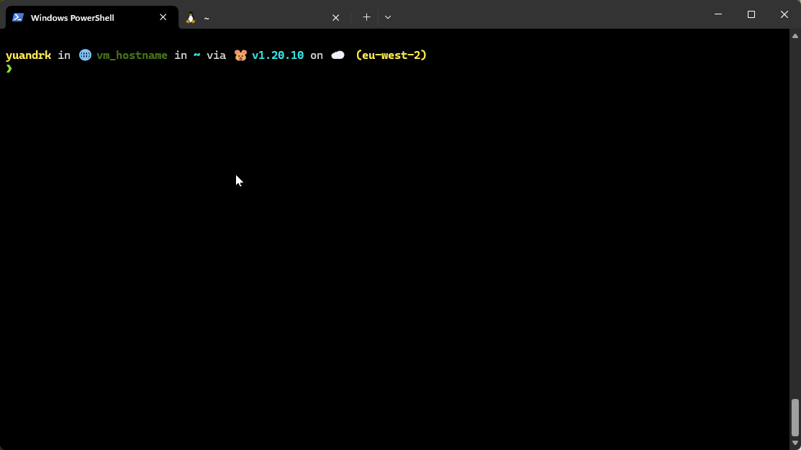

---

Comparative Analysis of Kubernetes Local Deployment Tools
=========================================================

Introduction
------------

AsciiArtify is evaluating tools for local Kubernetes development: minikube, kind, and k3d. 
This document provides a comparative analysis to aid in selecting the most appropriate tool for their PoC.

Characteristics
---------------

| Feature | minikube | kind | k3d |
| --- | --- | --- | --- |
| **OS/Architecture** | Linux, macOS, Windows | Most OS | Most OS |
| **Automation** | Good | Better | Best |
| **Additional Features** | Monitoring, Dashboard | Limited Monitoring | Fast Deployment |
| **Resource Efficiency** | Moderate | High | High |
| **Ease of Installation** | Easy | Moderate | Easy |
| **Cluster Creation Speed** | Moderate | Fast | Fastest |
| **Scalability** | Low | Moderate | Moderate |
| **Community and Support** | Strong | Growing | Emerging |
| **Integration with CI/CD** | Good | Excellent | Good |
| **Learning Curve** | Moderate | Steep | Moderate |
| **Customization Flexibility** | High | High | Moderate |
| **Network Complexity** | Low | Moderate | Low |

Advantages and Disadvantages
----------------------------

| Tool | Advantages | Disadvantages |
| --- | --- | --- |
| minikube | Easy setup, Comprehensive Docs, Strong Community | Limited Scalability, Resource-Intensive |
| kind | Efficient for CI/CD, Lightweight | Less Intuitive, Requires Docker Knowledge |
| k3d | Fastest Setup, Lightweight, Ideal for Rapid Prototyping | Less Mature, Limited Community Support |

Demonstration
-------------

Conclusions
-----------

**k3d** stands out as an optimal choice for AsciiArtify's PoC due to its rapid setup and deployment capabilities. Its lightweight nature makes it ideal for a startup environment where agility and quick iterations are key. While it may have a smaller community and less maturity compared to minikube and kind, its efficiency and ease of use for rapid prototyping outweigh these concerns.

**Rapid Prototyping:** k3d excels in quick cluster creation, making it perfect for fast-paced development cycles.
Resource Efficiency: Being lightweight, it minimizes resource utilization, crucial for startups with limited resources.

**Ease of Use:** Simplified setup process ensures quick onboarding and development commencement.

In summary, for AsciiArtify, which prioritizes speed and efficiency in their development process, k3d presents the most compelling advantages. Its suitability for fast prototyping aligns perfectly with the startup's needs for agile and efficient PoC development.

